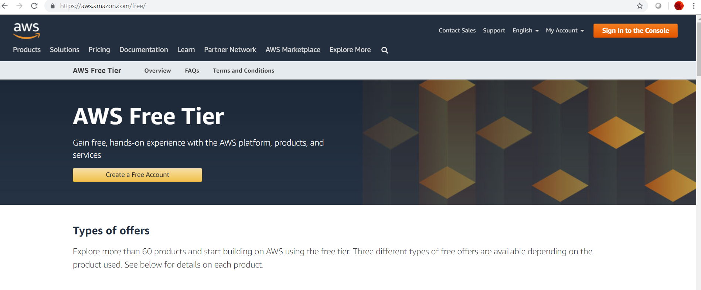
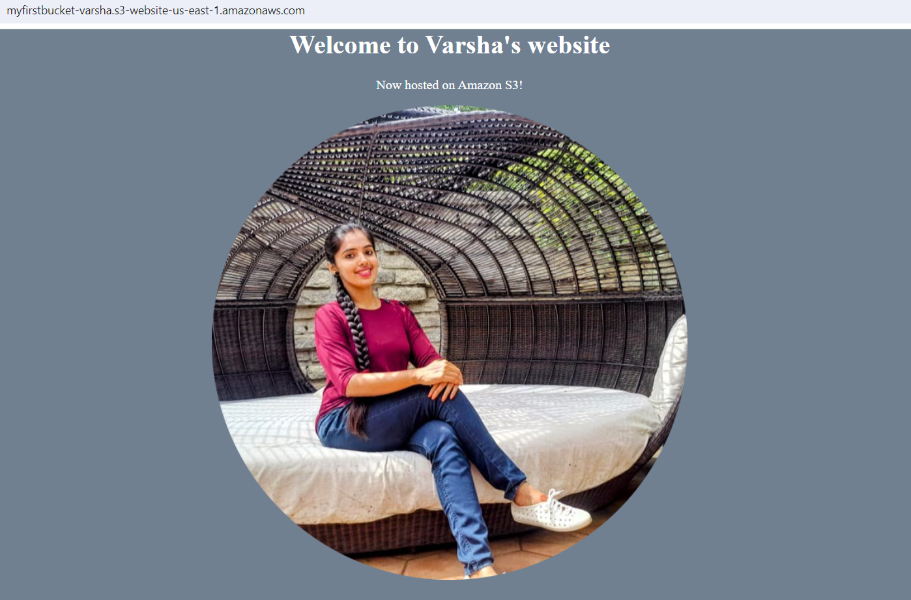

# How to host Static Website on Amazon S3

Amazon Simple Storage Service (Amazon S3) can be used to host static Websites without a need for a Web server (at an extremely low cost). S3 buckets can be used to host the HTML, CSS and JavaScript files for entire static websites.

## Introduction
A website is static when the system services used to render web pages and scripts are all client rather than server-based. On the other hand, a dynamic website relies on server-side processing, including server-side scripts such as PHP, JSP, or ASP.NET

Most websites are becoming static websites which means they run zero server side code and consist of only HTML, CSS and JavaScript. With no server side code to run, there is no reason to host them on a traditional server.

You can start by creating an Amazon S3 bucket, enabling the Amazon S3 Website hosting feature, and configuring access permissions for the bucket. After you have uploaded files and setup Website, Amazon S3 takes care of serving your content to your visitors.

**Amazon Route 53**: You can also use Amazon Route 53 (a managed Domain Name System (DNS) service) to point your domain to your Amazon S3 bucket.

**Amazon CloudFront**: You can also use Amazon CloudFront to enable your website to load quickly. Amazon CloudFront will create a content delivery network (CDN) that hosts your website content in close proximity to your users.

<br/>


## Advantages of Hosting Website on S3

Here are some of the advantages of hosting site on S3

* **Performance**: The website will be highly performant and scalable at a fraction of the cost of a traditional Web server.

* **Scalability**: Amazon S3 is inherently scalable. For popular websites, the Amazon S3 architecture will scale seamlessly to serve thousands of HTTP requests per second without any changes to the architecture.

* **Availability**: In addition, by hosting with Amazon S3, the website is inherently highly available.
 
## Prerequisites

* An AWS account

<br/>


## Set-Up Instructions

Below are the steps to deploy static Website on Amazon S3. You can follow these instructions to deploy your own static Website.

Open AWS Management console. Select S3 under Storage.

### Step 1 - Create an S3 Bucket

When you first create an S3 bucket, you select the AWS Region in which the files will be geographically stored.

* Click on "Create Bucket" button.

* Provide a globally unique name for bucket and select Region. 

* Leave blank this field "Copy Settings from an existing bucket".

<br/>


### Step 2 - Upload Content of your Website

Upload the website contents to your S3 bucket including sub-folders.

For Example:
You can use sample Website "Website" folder contents (provided in this repository).

* index.html
* error.html
* css
* images

<br/>


### Step 3 - Add a Bucket Policy to allow Public Read Access

Go to Permissions Tab and update Public Access Setting.

Uncheck "Block all public access".

Enabling Block Public Access helps protect your resources by preventing public access from being granted through the resource policies or access control lists (ACLs) that are directly attached to S3 resources. In addition to enabling Block Public Access, carefully inspect the following policies to confirm that they do not grant public access:

* Identity-based policies attached to associated AWS principals (for example, IAM roles).

* Resource-based policies attached to associated AWS resources (for example, AWS Key Management Service (KMS) keys). 

<br/>


Add following bucket policy. Replace [YOUR_BUCKET_NAME] with name of your bucket policy.

```
{ 
    "Version": "2012-10-17",
    "Statement": [
        {
            "Effect": "Allow", 
            "Principal": "*", 
            "Action": "s3:GetObject", 
            "Resource": "arn:aws:s3:::[YOUR_BUCKET_NAME]/*" 
        } 
    ] 
}
```

Click 'Save' button to save changes.


### Step 4 - Enable Website Hosting
In order to serve assets via url, you need to enable Website Hosting

Go to Properties and enable "Static Website Hosting" option

Note the endpoint.
http://{bucket-name}.s3-website-{AWS-Region}.amazonaws.com

<br/>


### Step 5 - Access Your Website (Testing/Validation)

Access the site in browser:
http://{bucket-name}.s3-website-{AWS-Region}.amazonaws.com

For Example:
<a href="http://myfirstbucket-varsha.s3-website-us-east-1.amazonaws.com">http://myfirstbucket-varsha.s3-website-us-east-1.amazonaws.com/</a>

<br/>


## References

* [What is Amazon S3](https://docs.aws.amazon.com/AmazonS3/latest/dev/Welcome.html)
* [Hosting a Static Website on Amazon S3](https://docs.aws.amazon.com/AmazonS3/latest/dev/WebsiteHosting.html) 
* [Example Walkthroughs - Hosting Websites on Amazon S3](https://docs.aws.amazon.com/AmazonS3/latest/dev/hosting-websites-on-s3-examples.html)
* [How to Host a Website on S3 Without Getting Lost in the Sear](https://medium.freecodecamp.org/how-to-host-a-website-on-s3-without-getting-lost-in-the-sea-e2b82aa6cd38)
* [Setup AWS S3 static website hosting using SSL](https://medium.com/@sbuckpesch/setup-aws-s3-static-website-hosting-using-ssl-acm-34d41d32e394)

## Author

* **Varsha S**
